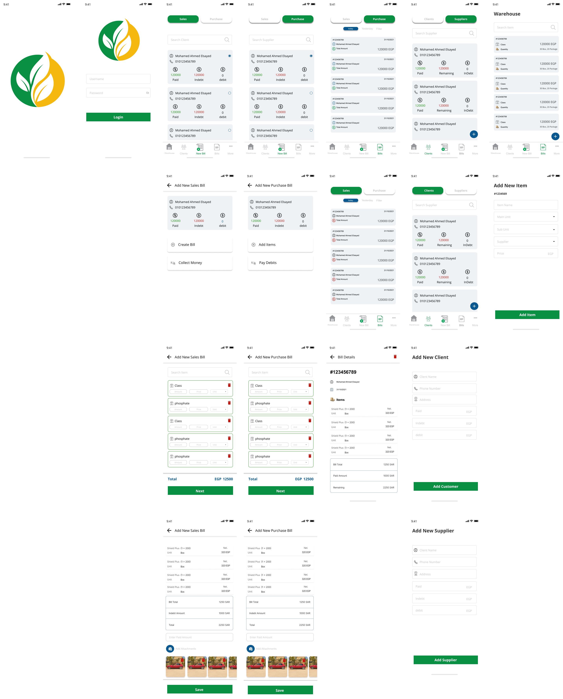

# Sales App

A Flutter project.

Screenshots
-------------



## Description:

### Data Check is :
An App that could help SEC of saudi arabia to review Surveying business company delivered spatial data, taking notes and also taking photos of each signle spatial data


### Our goal is:
- Store management (Amount of each product)
- Adding or removing products
- Tracking Sales bills transactions
- Tracking Purchase bills transactions
- Tracking customers billings (indebt - paided) money
- Tracking Suppliers billings (indebt - paided) money
- Adding new (Customer / Supplier)


## Libraries and Tools
- Flutter (Dart)
- Providers (Pattern)
- Firebase (FireStore - Authentication - Storage)
- Localizations (Arabic - English)
- Shared Preferences

## License

* [Apache Version 2.0](http://www.apache.org/licenses/LICENSE-2.0.html)

```
Copyright 2020 Ali Ussama

Licensed under the Apache License, Version 2.0 (the "License");
you may not use this file except in compliance with the License.
You may obtain a copy of the License at

 http://www.apache.org/licenses/LICENSE-2.0

Unless required by applicable law or agreed to in writing, software
distributed under the License is distributed on an "AS IS" BASIS,
WITHOUT WARRANTIES OR CONDITIONS OF ANY KIND, either express or implied.
See the License for the specific language governing permissions and
limitations under the License.
```
